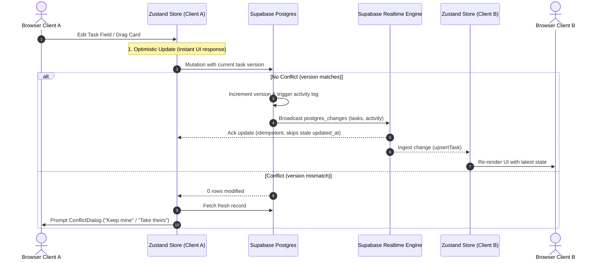

# SyncForge — Real-Time Collaborative Workspace

[](https://nextjs.org/)
[](https://react.dev/)
[](https://www.typescriptlang.org/)
[](https://supabase.com/)
[](https://tailwindcss.com/)
[](https://zustand-demo.pmnd.rs/)
[](https://dndkit.com/)

A high-performance, real-time collaborative project management workspace inspired by Linear, GitHub, and collaborative IDEs. Engineered with optimistic local updates, deterministic version-based conflict resolution, presence tracking, Postgres database triggers, and an executive real-time dashboard.

---

## Table of Contents

- [Key Features](#key-features)
- [Architecture & Data Flow](#architecture--data-flow)
- [System Design & Technical Highlights](#system-design--technical-highlights)
- [Directory Layout](#directory-layout)
- [Database Schema & Security](#database-schema--security)
- [Getting Started](#getting-started)
  - [Prerequisites](#prerequisites)
  - [Environment Setup](#environment-setup)
  - [Database Migration & Seeding](#database-migration--seeding)
  - [Running the App](#running-the-app)
- [Live Demo Guide (Multi-User Simulation)](#live-demo-guide-multi-user-simulation)
- [Available Scripts](#available-scripts)

---

## Key Features

### 1. High-Density Kanban Workspace
- **Drag-and-Drop Tasks**: Fluid multi-column board (`To Do`, `In Progress`, `Review`, `Done`) powered by `@dnd-kit` with pointer sensors and fractional positional calculations (`between()`).
- **Real-Time Synchronized State**: Changes made on any client immediately broadcast and reflect across all connected peers.
- **Fast Filtering & Search**: Instant client-side search by title/description, plus quick filters for *All*, *My Tasks*, *Overdue*, and *At Risk*.
- **Quick Task Creation**: Keyboard-accessible (`Ctrl+K` search, modal forms) task authoring with instant optimistic insertion.

### 2. Live Presence & Ephemeral Indicators
- **Active Viewers Bar**: Real-time presence tracking through Supabase Channels displays which teammates currently have a task drawer open.
- **Live Typing Indicators**: Debounced broadcast events notify collaborators when another member is actively typing a comment.
- **Connection Health State**: Visual status badge (`Live`, `Connecting`, `Reconnecting`) with automatic heartbeat and reconnection recovery.

### 3. Concurrency & Conflict Handling
- **Optimistic Concurrency Control**: Tasks maintain an integer `version` field. Mutations require matching versions:
  ```sql
  UPDATE tasks SET ..., version = version + 1 WHERE id = taskId AND version = currentVersion;
  ```
- **Interactive Diff Dialog**: If a concurrent update is detected (version mismatch), the client intercepts the collision and renders a side-by-side diff modal allowing users to choose **Keep mine** or **Take theirs**.

### 4. Comprehensive Task Drawer & Audit Timeline
- **Single Source of Truth Audit Log**: Client code never writes to the activity table directly. PostgreSQL database triggers on `tasks`, `comments`, and `attachments` guarantee tamper-proof historical logging.
- **Markdown Comments**: Instant communication with author avatars, relative timestamps, and auto-scrolling timeline.
- **Secure File Attachments**: Drag-and-drop file upload directly to private Supabase Storage buckets with client-side file size guards (10MB limit) and expiring signed download URLs.

### 5. Executive Dashboard
- **Cross-Project Health**: Real-time stats calculation displaying **Overdue Tasks**, **At Risk Tasks** (due within 48h), **Open Tasks**, and **Completion Rate**.
- **Workload Distribution**: Visual bar breakdown of task allocation across team members.
- **Project Progress Tracker**: Aggregate completion percentages linked directly to each project's Kanban workspace.

---

## Architecture & Data Flow



### Idempotent Real-Time Updates
To prevent race conditions and stale echoes from overwriting fresher local optimistic updates, the Zustand store strictly compares timestamps:
```typescript
if (existing && existing.updated_at >= incoming.updated_at) {
  return prev; // Ignore stale echo
}
```

---

## System Design & Technical Highlights

| Architectural Area | Implementation Strategy |
|---|---|
| **Client State** | Single Zustand store per project session (`useProjectStore`), storing tasks, activity, profiles, presence, and typing status. |
| **Data Integrity** | Activity audit trail generated exclusively via Postgres triggers; client never inserts raw audit events. |
| **Offline Handling** | Disconnected writes are rejected cleanly instead of silently queued to avoid out-of-order write conflicts upon reconnection. |
| **Date Calculations** | Normalized `yyyy-MM-dd` date strings are compared directly, preventing timezone off-by-one errors. |
| **Drag Reordering** | Midpoint fractional positioning (`between(prev, next)`) avoids bulk position rewrites. |

---

## Directory Layout

```
algothon/
├── app/
│   ├── auth/callback/       # PKCE code & token exchange handler
│   ├── dashboard/           # Real-time executive dashboard
│   ├── login/               # Authentication (Sign in / Sign up)
│   ├── projects/            # Canonical redirects to active workspace
│   │   └── [id]/            # Main collaborative Kanban workspace
│   ├── globals.css          # Tailwind utilities & theme tokens
│   ├── layout.tsx           # App root layout with LayoutShell & toast provider
│   └── page.tsx             # Root redirect to /dashboard
├── components/
│   ├── board/               # Board, Column, TaskCard, ConflictDialog
│   ├── dashboard/           # StatCard, WorkloadBars, ProjectProgress, OverdueList
│   ├── task/                # TaskDrawer, TaskFields, Timeline, Attachments, Comments
│   ├── ui/                  # Avatar, ConnectionBadge, OfflineBanner, Skeleton, EmptyState
│   ├── Header.tsx           # Global authenticated navigation header
│   ├── AuthGuard.tsx        # Client session route guard
│   └── LayoutShell.tsx      # Conditional chrome wrapper
├── docs/                    # Architecture records, demo scripts, design specifications
├── lib/
│   ├── hooks/               # useSession, useProjectRealtime, usePresence
│   ├── dashboardStats.ts    # Pure metrics calculators (overdue, workload, completion)
│   ├── mutations.ts         # Supabase mutation wrappers with version checks
│   ├── store.ts             # Central Zustand store
│   ├── supabase.ts          # Singleton Supabase client
│   └── types.ts             # TypeScript definitions (single source of truth)
├── scripts/
│   └── seed.ts              # Database seed script for demo workspaces and users
├── schema.sql               # Full PostgreSQL schema, triggers, RLS, and functions
└── README.md
```

---

## Database Schema & Security

The database runs on PostgreSQL with Supabase extensions:
- **`profiles`**: User profiles with display names and avatar colors, linked to `auth.users`.
- **`projects` & `project_members`**: Workspace definitions, join codes, and membership mappings.
- **`tasks`**: Work items containing `title`, `description`, `status`, `due_date`, `position`, `version`, and `archived`.
- **`comments`**: Task discussions with author relations.
- **`attachments`**: File metadata referencing Supabase Storage paths.
- **`activity`**: Immutable event log automatically populated by triggers on `tasks`, `comments`, and `attachments`.

### Row Level Security (RLS)
Every table enforces strict RLS policies ensuring users can only view, mutate, or subscribe to projects and tasks for which they are active members.

---

## Getting Started

### Prerequisites
- **Node.js**: `v18.18.0` or higher
- **npm** / **pnpm** / **yarn**
- A [Supabase](https://supabase.com) project (or local Supabase instance)

### Environment Setup

Create a `.env.local` file in the project root:

```bash
# Public Supabase credentials
NEXT_PUBLIC_SUPABASE_URL=https://your-project.supabase.co
NEXT_PUBLIC_SUPABASE_ANON_KEY=your-anon-key

# Required only for running the database seed script
SUPABASE_SERVICE_ROLE_KEY=your-service-role-key
```

### Database Migration & Seeding

1. Open your Supabase Dashboard → **SQL Editor**.
2. Paste and run the entire contents of [`schema.sql`](./schema.sql).
3. Ensure the private storage bucket `attachments` exists (or let the schema/seed configure it).
4. Run the seed script to populate sample accounts, a demo project, tasks, comments, and attachments:

```bash
npm run seed
```

### Running the App

Start the development server:

```bash
npm run dev
```

Open [http://localhost:3000](http://localhost:3000) in your browser.

---

## Live Demo Guide (Multi-User Simulation)

To experience the real-time features and conflict handling, open **two separate browser windows** (or one normal window and one incognito window):

### Demo Accounts (Created by `npm run seed`)
- **Browser 1**: `aarav@demo.com` / `demo1234`
- **Browser 2**: `priya@demo.com` / `demo1234`

### Walkthrough Steps

1. **Live Presence**: Open the same task card in both browsers. The drawer header will show the other user's avatar with *"X is also viewing"*.
2. **Real-time Typing**: Start typing a comment in Browser 2. Browser 1 will immediately display the *"Priya is typing..."* indicator. Submit the comment to see it render in both timelines instantly.
3. **Conflict Resolution**:
   - In Browser 1, edit the task title and blur to save.
   - In Browser 2, edit the task title to something different and blur to save.
   - Browser 2 will display the **Conflict Dialog** with a side-by-side diff allowing you to choose between your version and the latest remote version.
4. **Drag-and-Drop Sync**: Drag a card from *To Do* to *In Progress* in Browser 1. Notice the card instantly glide to the new column in Browser 2 without page reloads.
5. **Real-Time Executive Dashboard**: Navigate to `/dashboard` in Browser 2 while changing task states in Browser 1. Watch the completion percentage, open task counts, and workload bars update live.

---

## Available Scripts

| Command | Description |
|---|---|
| `npm run dev` | Starts Next.js development server with Turbopack |
| `npm run build` | Builds optimized production bundle |
| `npm run start` | Runs the production build server |
| `npm run lint` | Runs ESLint analysis |
| `npm run seed` | Seeds Supabase database with demo users, projects, and tasks |

---

## License

MIT License. Crafted for team collaboration and modern engineering workflows.
